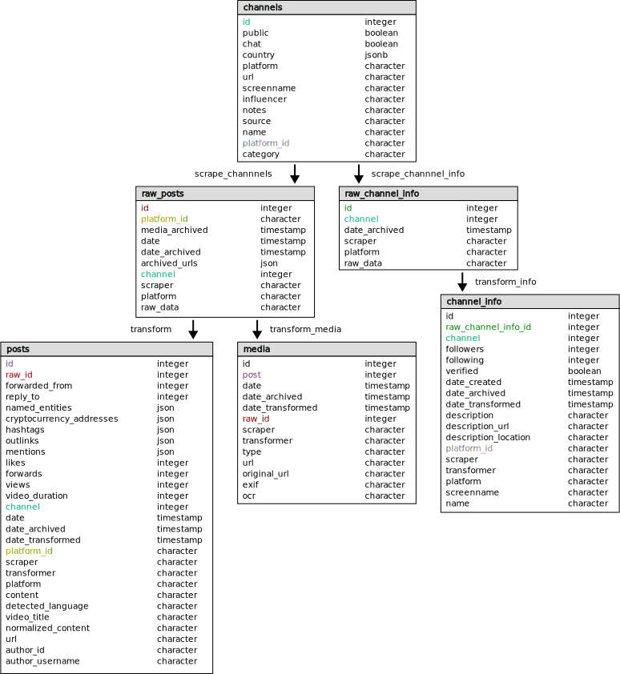

About Cisticola
===============

The *cisticola* application enables users to easily collect, process, and analyze large-scale data from several social media platforms.

Definitions
-----------
- *Platform*: a social media website, for example Telegram, YouTube, or Rumble.
- *Channel*: an account or group on a platform, for example Twitter users, Telegram private chat groups, YouTube channels, and Gab groups.
- *Post*: a single item created by a channel, for example a Telegram message, a Tweet, or a YouTube video. Posts can contain one or more media attachments.
- *Media*: a file uploaded to a platform by a channel as part of a post. Often images or video but can include audio, or for some platforms arbitrary file types (such as PDFs).

Components
----------
Cisticola has many components, including:

- The :py:mod:`cisticola.base` module contains Object Relational Mapping (ORM) dataclasses that imperatively map to pre-defined SQL tables
- The :py:mod:`cisticola.scraper` subpackage contains platform-specific modules for scraping raw data from platforms. For example, the :py:mod:`cisticola.scraper.bitchute` module extracts raw data from Bitchute.
- The :py:mod:`cisticola.transformer` subpackage contains platform-specific modules for converting raw data into a standardized, cross-platform format.

The data extracted by scrapers varies by platform, but typically includes media files attached to posts. 

Separating the "scraping" and "transforming" steps is useful because it ensures that no data is thrown away during the transormation. There may be some fields in the raw data that aren't included in the transformed format, but could be found to be useful in the future.

Tables
------
The database Cisticola uses to archive and store data consists of 6 tables. Their names, respective ORM mapping in :py:mod:`cisticola.base`, and a brief description are shown below:

- ``channels`` (:py:class:`cisticola.base.Channel`): User-specified information about a channel
- ``raw_posts`` (:py:class:`cisticola.base.ScraperResult`): Minimally processed information scraped from a post 
- ``posts`` (:py:class:`cisticola.base.Post`): Processed information about a post
- ``raw_channel_info`` (:py:class:`cisticola.base.RawChannelInfo`): Minimally processed information scraped from a channel
- ``channel_info`` (:py:class:`cisticola.base.ChannelInfo`): Processed information about a channel
- ``media`` (:py:class:`cisticola.base.Media`): Processed information about a media file attached to a post

The diagram below shows all columns in each table and their data types, with certain shared primary and foreign key columns colored differently to distinguish them.

TODO
- Add diagram
- Describe common workflow and steps
- Update environment variables